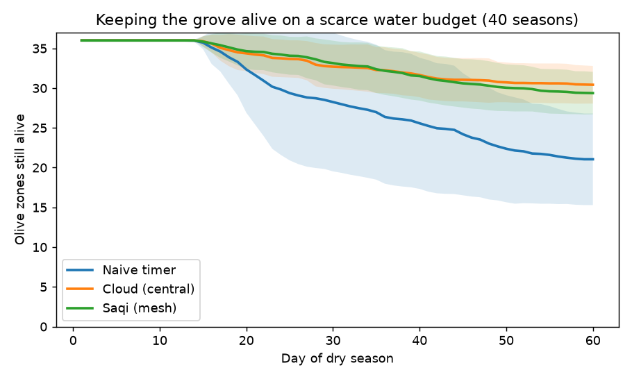
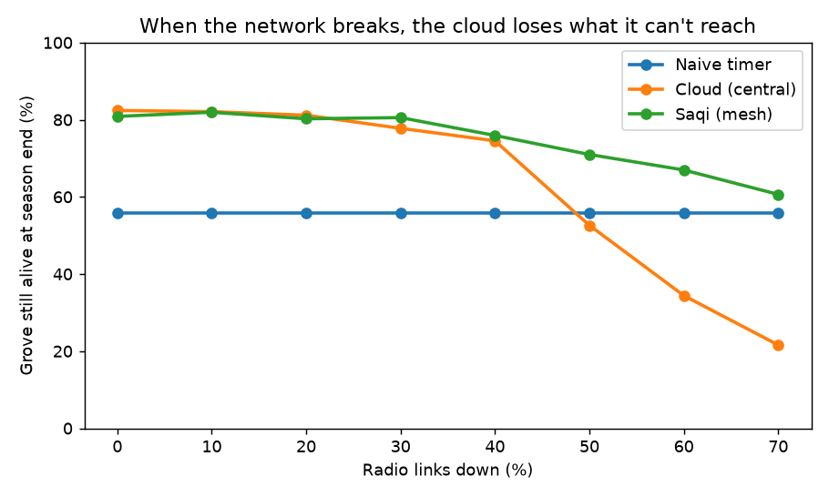
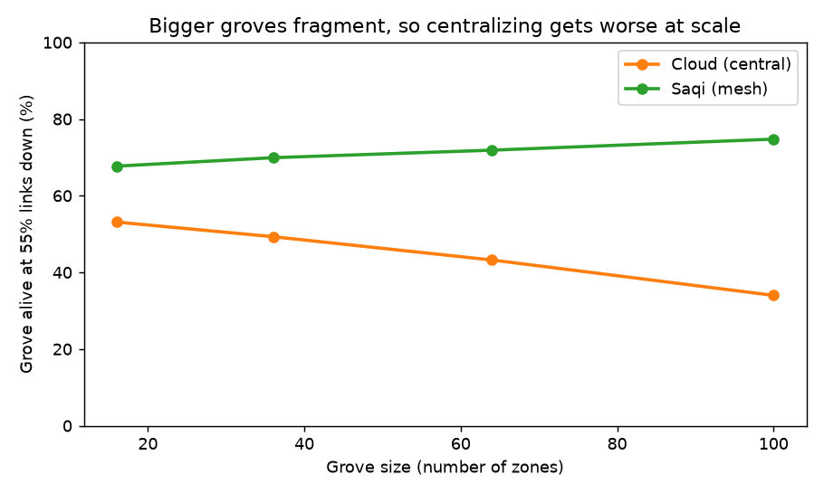

# Saqi

Decentralized, offline water-sharing for olive groves. A simulation I built for the
Moonshot 2026 hackathon.

The question behind it is simple: when a farm doesn't have enough water for every plant, who
gets it? The usual answer in "smart farming" is a cloud server that watches the whole farm and
decides. But I'm from an olive-farming family in Sidi Bou Zid, Tunisia, and the tools I kept reading
about all assume Wi-Fi, grid power, and money, none of which our kind of farm has. So I wanted
to test the opposite idea: no server at all.

In Saqi, every zone of the grove runs a cheap device that only talks to the zones next to it.
They interact with each other until they agree on where the scarce water should go, keeping every
zone alive instead of spoiling a few. The whole thing works with no internet and no central
computer, and it keeps working even when parts of the network drop out.

## How it works

Each zone tracks its soil moisture. Every day there's a small shared water budget, never enough
for everyone. The goal is max-min: water the most desperate zones first, up to a safe line,
since olives survive on very little and the point is to lose nothing.

To decide that without any node seeing the whole farm, the nodes run average consensus (gossip):
each one repeatedly averages its water demand with its neighbours until the connected patch
agrees on a single cutoff. Everyone below the cutoff waters itself. If the network splits, each
piece just solves its own smaller version, which is the whole reason it survives failures.

## Results

I compare Saqi against a naive timer (equal split) and a "cloud" controller that sees everything
(the best you can do on the budget). Averaged over many random seasons:

- Connected: Saqi keeps about as many zones alive as the all-seeing cloud, both far above the
  timer.

  

- Network breaking: as radio links fail, the cloud collapses once it can't reach part of the
  farm, dropping below even the dumb timer, while Saqi degrades gently.

  

- Scale: in a broken network, bigger farms split into more islands, so the cloud gets worse as
  the farm grows and Saqi doesn't.

  

## Running it

```bash
pip install -r requirements.txt
python3 saqi.py          # the main comparison -> saqi_demo.png
python3 experiments.py   # resilience + scaling -> saqi_resilience.png, saqi_scaling.png
```

## What's in here

- `saqi.py`: the model and the three strategies (naive / cloud / Saqi)
- `experiments.py`: the resilience and scaling experiments
- `*.png`: the figures
- `Saqi Moonshot Paper.pdf`: the full write-up

## Limitations

It's a simulation with a simple soil/weather model, and it tests the decision-making, not the
actual plumbing (I assume each node can draw its own share of water locally). A real version
would need cheap hardware, soil calibration, and a season of field tests. Next step is to build
a few real nodes on the family farm.

## AI use

I used AI assistants to help debug the code. (Moonshot
allows AI as a tool as long as the thinking is human.)

## License

MIT. See `LICENSE`.
